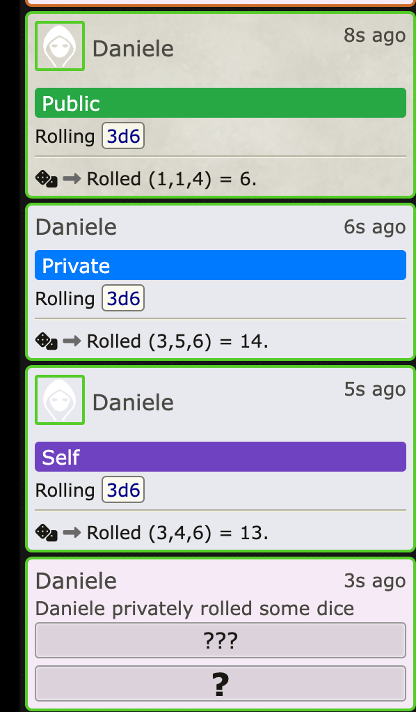

# Giggioz Better Labels

**Giggioz Better Labels** is a Foundry VTT module that enhances chat message visibility by dynamically labeling messages rolls based on their privacy settings.

## Features

1. **Chat Message Visibility Labels**:
   - **Public**: Green label for message rolls visible to all.
   - **Private**: Blue label for message rolls whispered to specific users.
   - **Self**: Purple label for message rolls whispered to oneself.
   - **Blind**: Red label for message rolls marked as blind.
   - **GM-Specific Behavior**: Private andn Self Messages Rolls for the GM are basically the same thing, a label is shown as "Private/Self is Self for GMs."

## Installation

1. Install manually the module in Foundry using "https://github.com/giggioz/giggioz-better-labels/releases/download/_LATEST_VERSION_/module.json"
2. For example https://github.com/giggioz/giggioz-better-labels/releases/download/v1.0.27/module.json
3. Enable the module in your game by going to **Game Settings** > **Manage Modules** and checking **Giggioz Better Labels**.

## Usage

### Chat Labels

Labels are automatically added to chat messages based on their visibility:

## Development

To develop in local enviroment run ./create-symlink.sh to create a copy of this repo into  foundry modules. Chek the file to setup your path.

## Contributing

Feel free to submit issues or pull requests if you have improvements or bug fixes.

## Buy Me a Coffee

If you find this module useful and want to support its development, consider buying me a coffee! ☕

## License

This project is licensed under the MIT License. See the [LICENSE](./LICENSE) file for details.
