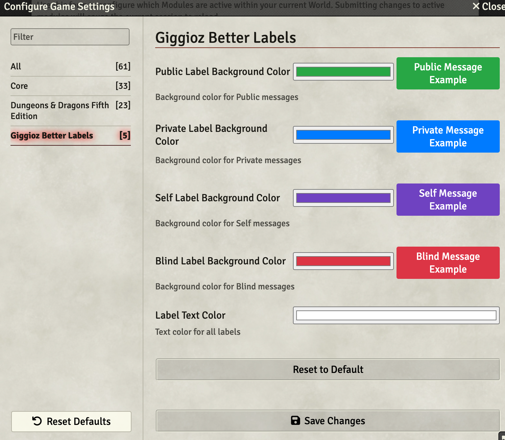

# Giggioz Better Labels

**Giggioz Better Labels** is a Foundry VTT module that enhances chat message visibility by dynamically labeling message rolls based on their privacy settings. The module also includes a customizable **Settings UI** for adjusting label colors.

## Features

1. **Chat Message Visibility Labels**:
   - **Public**: Green label for message rolls visible to all.
   - **Private**: Blue label for message rolls whispered to specific users.
   - **Self**: Purple label for message rolls whispered to oneself.
   - **Blind**: Red label for message rolls marked as blind.
   - **GM-Specific Behavior**: Private and Self Messages Rolls for the GM are the same. The label shows as "Private/Self is Self for GMs."

2. **Customizable Settings**:
   - Adjust label background and text colors directly in the **Settings UI**.
   - Preview changes live before applying them.
   - Reset colors to default with a single click.

## Installation

1. Install the module in Foundry using:
   - **Latest Release**: `https://github.com/giggioz/giggioz-better-labels/releases/download/_LATEST_VERSION_/module.json`
   - Example: `https://github.com/giggioz/giggioz-better-labels/releases/download/v1.0.27/module.json`
2. Enable the module in your game by navigating to **Game Settings** > **Manage Modules** and checking **Giggioz Better Labels**.

## Usage

### Chat Labels

Labels are automatically added to chat messages based on their visibility settings:

### Settings UI

You can customize the label colors via the module’s **Settings UI**:

1. Navigate to **Game Settings** > **Configure Settings** > **Module Settings** > **Giggioz Better Labels**.
2. Adjust the colors for each label type using the color pickers.
3. Preview the changes directly below the color pickers.
4. Click **Reset to Default** to revert all settings.

## Development

To set up a local development environment:

1. Run `./create-symlink.sh` to create a symbolic link from this repository to Foundry's modules folder.
2. Edit the script to set up the correct path for your system.

## Contributing

Feel free to submit issues or pull requests if you have improvements or bug fixes.

## Buy Me a Coffee

If you find this module useful and want to support its development, consider buying me a coffee! ☕

## License

This project is licensed under the MIT License. See the [LICENSE](./LICENSE) file for details.
